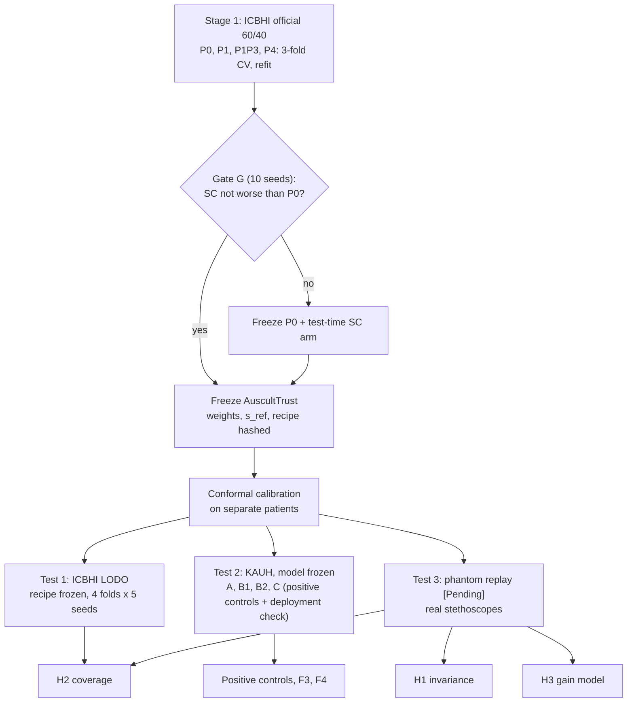

# Improving the Reliability of Lung-Sound Classification under Device Shift with Spectrum Correction and Conformal Prediction, for Respiratory Screening Support

**Registered title (fixed):** *Nghiên cứu giải pháp cải thiện độ tin cậy của mô hình phân loại âm thanh phổi dưới sự dịch chuyển thiết bị bằng hiệu chỉnh phổ và dự đoán Conformal cho hỗ trợ sàng lọc bệnh đường hô hấp*

> Proposal v9, 07/10/2026 (revised the same day: [46] read, TTA-EQ comparator added). KHKT 2026–2027, THPT chuyên Chu Văn An. Replaces v8 (decision log: Appendix C).
> Tags: **[Fact]** cited and checked, or measured in our repo · **[Interpretation]** reasoned from facts · **[Hypothesis]** testable, not shown · **[Assumption]** planning choice, to confirm · **[Pending]** blocked on hardware.
> Repo facts: `auscult-trust` `report.md` (Phase 0, to 05/10/2026). Open items: *[to verify]*.

---

## 0. Summary

**Core problem.** A conformal lung-sound classifier promises that its prediction set contains the true class with a chosen probability. The promise holds only for data like the calibration data. When the stethoscope changes, predictions change and the promise breaks without warning.

**Solution under test (AuscultTrust).**
- **(1) Spectrum correction (SC) front end.** A fixed reference spectrum is taken from the training devices. A new device is corrected with its own mean spectrum, estimated from unlabelled recordings.
- **(2) Classifier.** AST with the Patch-Mix CL recipe, trained on SC-corrected input.
- **(3) Conformal layer.** Split conformal, with two views: cycle-level 4-class sets (the benchmark task) and recording-level normal/abnormal sets (screening triage).

**Central claim to test.**
1. Device shift is mostly a per-frequency gain.
2. SC removes that gain.
3. Predictions then no longer depend on the device.
4. So the calibration transfers, and coverage holds without labels from the new device.

**Research question.** Does spectrum correction let a benchmark-level lung-sound classifier keep its predictions and its conformal coverage when the stethoscope changes, without labels from the new stethoscope?

**Hypotheses (one chain) and where each is decided.**

| Link | ID | Statement | Primary test | Positive control |
|---|---|---|---|---|
| Why SC should work | **H3** | Paired log-mel shift between real stethoscopes is mostly a per-frequency gain | Phantom [Pending] | — |
| Predictions | **H1** | SC lowers prediction changes between devices on the same sound | Phantom transducer pairs [Pending] | KAUH filter pairs |
| Guarantee | **H2** | SC brings conformal coverage on an unseen device closer to nominal, at no larger set size | ICBHI leave-one-device-out (prior-matched); co-primary phantom | KAUH filter-to-filter |

- **Stage-1 gate G.** The SC classifier is not worse than the same recipe without SC on the ICBHI benchmark.
- **Positive controls.** KAUH filters are vendor software and close to linear by design. SC should succeed there almost by construction, so a failure would mean the implementation or the gain assumption is broken. A pass supports no claim about real hardware.

**Design.** Two stages.
- **Stage 1 (model).** Official ICBHI 60/40 split, 4-class and 2-class, Sp, Se, Score, 5 seeds, as in the reference papers.
- **Stage 2 (experiments).** Model or recipe frozen; conformal calibration on separate patients; three tests: ICBHI leave-one-device-out (LODO), KAUH filter renderings (measurements A, B, C), lung-phantom replay.

**Contributions.**

| # | Contribution | Evidence |
|---|---|---|
| C1 | AuscultTrust: a lung-sound classifier with an SC front end and a conformal screening layer, benchmarked on the ICBHI official split with per-device Sp and Se | Stage 1: G, F1 |
| C2 | Measured effect of SC on conformal coverage across real devices, without target labels; published models re-run under one centralised LODO protocol, with a secondary split matching [46] | H2; F2–F5 |
| C3 | Physical test of the gain assumption and of prediction invariance with real stethoscopes | H3, H1 [Pending] |

**Not claimed:** a new algorithm (the solution assembles known parts and tests them where they were never tested); a SOTA Score; disease diagnosis (the screening endpoint is abnormal lung sound); guarantees on patients; KAUH software filters as real hardware.

---

## 1. Background

| Statement | Status | Source |
|---|---|---|
| Devices differ in frequency response; models learn the device; performance drops on unseen devices | [Fact] | [8]–[10], [3] |
| Four digital stethoscopes on one chest phantom: pairwise frequency-response correlations 0.14–0.91. One pair: 0.88 on the phantom, 0.91 on a human chest | [Fact] | [7] Tab. 3 |
| Replaying database lung sounds through a chest phantom and re-recording with stethoscopes is an established test setup | [Fact] | [7], [10] |
| SC: per-bin gain from mean spectra. Aligned and unaligned (different content) variants gave equal accuracy; few recordings suffice; mobile-device accuracy 59→66% and 61→72% | [Fact] | [1] |
| SC on ICBHI: Score 56.67 ± 1.16 → 58.29 ± 0.46 (co-tuned ResNet50, official split). Reference from all four devices, including test devices. No unseen device, no calibration or coverage reported | [Fact] | [3] Tab. IV |
| IR augmentation + Freq-MixStyle improve unseen-device accuracy in acoustic scene classification; no coverage reported | [Fact] | [4] |
| ICBHI cycles per device, train/test: Meditron 997/459; LittC2SE 594/0; Litt3200 41/461; AKGC417L 2,510/1,836 | [Fact] | [8]. [14] swaps the Litt3200/LittC2SE labels; our runs confirm Litt3200 has official-test cycles and LittC2SE has none (report §17.2). [46] Tab. 1 per-device counts sum to 7,511, not 6,898 (unit differs). Filename recount: TODO |
| AKGC417L holds 1,543 of 1,864 crackle cycles | [Fact] | [14] |
| ICBHI patients per device (repo recount): AKGC417L 32, Litt3200 11, LittC2SE 23, Meditron 64. Patients 112, 158, 218, 226 are on two devices. The published official split puts 2 patients on both sides | [Fact], repo | report §1 |
| ICBHI recordings sampled at 4 kHz (90), 10 kHz (6), 44.1 kHz (824) | [Fact] | [30] |
| KAUH: 112 subjects, Littmann 3200 (same model as ICBHI Litt3200). Each recording is exported by the vendor software with three filters: Bell (20–1000 Hz, emphasis 20–200), Diaphragm (20–2000, emphasis 100–500), Extended (20–1000, emphasis 50–500). Sound labels: normal 35, crepitation 23, wheeze 41, crackle 8, wheeze + crackle 2, bronchial + crackle 2, bronchial 1 | [Fact] | [31] |
| KAUH sampled at 4 kHz | [Assumption] | Repo loader; check the files |
| Unclipped SC between a 4 kHz-band and a full-band device at 16 kHz gives +65 to +70 dB gain above 2.2 kHz (synthetic noise; depends on the resampler) | [Fact], repo check 07/10 | `src/shift/correction.py` |
| Split conformal is valid under exchangeability; validity breaks under shift unless corrected | [Fact] | [15]–[17] |
| Device leave-out on ICBHI exists in a federated setting: held-out AKGC417L, Meditron, SPRSound-Yunting, and pooled Littmann (LittC2SE + Litt3200); patients on > 1 stethoscope removed; 3 seeds, no SD. Patch-Mix CL OOD Score: AKGC 51.32, Meditron 58.81, Yunting 52.88, LittC2SE 56.58, Litt3200 35.90. No calibration or coverage reported | [Fact] | [46] Tab. 4 |
| Deterministic removal of a device mean (background log-mel), close in spirit to SC, gave mixed OOD results vs FedAvg: AKGC 32.59 vs 50.26 (Sp 11.49), Yunting 39.04 vs 62.20, Meditron 54.08 vs 52.31, LittC2SE 64.53 vs 61.19, Litt3200 38.01 vs 38.11 | [Fact] | [46] Tab. 2 |
| Stochastic style intervention (random gain + smooth frequency-gated perturbation) gave the largest OOD gain in ablation (e.g. AKGC 48.15 → 52.82) | [Fact] | [46] Tab. 3 |
| In [46], all methods stay near or below the constant-normal Score of 50 on AKGC417L, Meditron and Litt3200 | [Fact] | [46] §4.2.1 |
| No centralised LODO result with calibration or coverage on ICBHI among the checked references | [Assumption], search-limited | [8], [46], [48]–[50] |

**Problems.**
- **P1 — Silent failure.** Coverage and predictions change with the device, and nothing warns the user.
- **P2 — Untested assumption.** SC assumes a per-frequency gain. Nobody has checked that on real stethoscopes, or checked whether SC repairs coverage.
- **P3 — Hidden by the benchmark.** Pooled Score hides Sp vs Se and per-device failure. On ICBHI, device co-varies with patient, site and class mix.

---

## 2. Research Gap

| Area | Exists | Missing |
|---|---|---|
| SC | Accuracy gains, acoustic scenes [1], [2]; ICBHI official split [3] | Unseen stethoscope; prediction invariance; coverage |
| Conformal for respiratory audio | Cough and respiratory events [25], [26] | Lung auscultation under device shift |
| Device-robust lung-sound training | SG-SCL [8], metadata contrastive [9]; federated device leave-out with style intervention [46] | Coverage; per-device Sp/Se; SC under unseen devices; centralised LODO for all models |
| Stethoscope frequency response | Phantom studies [6], [7], [10] | Link from measured response to classifier output |

Closest work:
- [3]: SC on ICBHI, Score only.
- [46]: device leave-out on ICBHI, Score only. In [46], a deterministic device-mean removal was unreliable and stochastic style perturbation helped. This is a direct risk for SC, tested here, not assumed away.

---

## 3. Preliminary Evidence (Phase 0)

| Observation | Value | Status | Consequence for v9 |
|---|---|---|---|
| Patch-Mix CL reproduction, 5 seeds | 61.49 ± 0.91 best-on-test (published protocol; published 62.37 ± 0.61); 59.59 ± 0.47 last epoch | [Fact] | P0 matches the published level under the published protocol; under our test-free protocol expect ≈ 59.6 |
| Frozen and partially tuned encoders | Best frozen AST 54.7 ± 1.3; best partial fine-tune AST 57.3 ± 1.9 | [Fact] | Stage 1 uses full fine-tuning |
| Split conformal, official split, frozen encoders | V1 coverage 0.83–0.86 at nominal 0.90 | [Fact] value; [Interpretation] cause | Shift between train and test devices is likely. Confound: 12 validation patients chose the epoch and also calibrated |
| ICBHI device held out, V1 coverage | AKGC417L 0.68–0.97; Litt3200 0.47–0.98; Meditron 0.87–1.00, by encoder and rung | [Fact] | Device effect mixed with class mix: needs prior-matched analysis |
| KAUH filter pairs, models trained on KAUH | Score falls (AST head 0.579 → 0.499). Coverage: OPERA probes 0.89–0.91 → 0.45–0.49; AST L0 0.881 → 0.841; AST L1 0.892 → 0.914 | [Fact] | Filters change predictions. Coverage error goes either way, so use \|Δ\| |
| SC | Implemented (`--a1_input`, `src/shift/correction.py`); not evaluated; no gain clip; s_ref not saved | [Fact] | Fix before Stage 1 (§5.2) |

---

## 4. Hypotheses and Findings

### 4.1 Stage 1 gate

| ID | Statement | Passed if |
|---|---|---|
| **G** | The SC classifier is not worse than P0 on ICBHI official split, 4-class | Paired ΔScore (AuscultTrust − P0) over **10 seeds** (0–9), CV epoch: 95% t-interval lower bound > −1.5 points |

- **Margin −1.5 [Assumption, registered].** About half of the published gap between plain AST fine-tuning (59.55) and Patch-Mix CL (62.37) [48]. SC must keep at least half of what the recipe gains over plain fine-tuning.
- **Power.** The training script is not deterministic, so paired seeds are treated as independent. With seed SD 0.9: SE = √2·0.9/√10 ≈ 0.40 and t₉ = 2.26. P(pass | true Δ = 0) ≈ 0.9 [Interpretation]. With 5 seeds it would be ≈ 0.5.
- **Benchmark reporting.** Seeds 0–4 are reported, as in the literature.
- **If G fails.** Stage 2 uses P0 plus test-time SC as the SC arm, and the failure is reported.

### 4.2 Hypotheses

Arms are named per test.
- **"SC pipeline":** AuscultTrust weights with SC at test time.
- **"Baseline pipeline":** P0 weights without SC.
- **Isolation contrast (same weights):** P0 with vs without test-time SC.

| ID | Primary test | Statistic | Rejected if |
|---|---|---|---|
| **H1** | Phantom, ≥ 3 distinct transducers, all pairs [Pending] | Flip rate of cycle 4-class argmax, SC pipeline − baseline pipeline, pooled over pairs; bootstrap by source patient | 95% CI includes 0 or lies above 0 |
| **H2** | ICBHI LODO, 4 folds; co-primary phantom pairs | D = mean over tested folds of (\|Δ_base\| − \|Δ_SC\|). Δ = prior-matched coverage − 0.90. Two-level bootstrap: seeds and patients (calibration and evaluation), with recalibration in every draw. Also the mean set-size change | CI of D includes 0, or the set-size change has a CI above 0 |
| **H3** | Phantom [Pending] | Explained fraction (§5.6), median over transducer pairs | Median < 0.8 |

**Testability gate for H2.**
- A fold enters D only if its \|Δ_base\| exceeds the 95th percentile of \|Δ\| under no shift.
- The no-shift distribution comes from exchangeable re-splits of the source-device patients, with the same calibration and evaluation sizes.
- The gate therefore includes calibration noise and patient clustering.
- If no fold passes, H2 is reported as "no device-induced coverage error detectable on ICBHI". The phantom then decides H2.

**Positive controls** (registered; must pass, support no claim):
- **KAUH-A:** flip rate drops with SC.
- **KAUH-B2:** \|Δ\| drops with SC wherever \|Δ_base\| passes the same kind of null gate.
- A failure triggers a check of the SC code and of filter linearity before any other Stage-2 result is read.

**Chain logic.**
- H3 asks whether the gain model holds physically.
- H1 asks whether removing the gain removes the device from the predictions.
- H2 asks whether that is enough for the calibration to transfer.
- If H1 holds and H2 fails: device is not the only shift, and the k-shot fallback (F5) gives the label cost of repair.
- If H3 fails: H1 and H2 measure how far a wrong model still helps.

### 4.3 Registered findings (no directional hypothesis)

| F | Finding | Data |
|---|---|---|
| F1 | Per-device Sp, Se, Score, HS; 4-class and 2-class; CV-epoch and literature columns | ICBHI official |
| F2 | LODO benchmark: Sp, Se, Score per held-out device and macro-averaged (with and without the AKGC417L fold), for P0, P4, AuscultTrust (optional AST-CE, SG-SCL). Class-mix vs device split of coverage error (raw, prior-matched, V4-oracle). Isolation contrast | LODO |
| F3 | Screening view: referral rate, screening Se and Sp of singleton decisions. Deployment check B1 (ICBHI-calibrated threshold applied to each KAUH filter) | ICBHI E0, KAUH |
| F4 | SC practicality: unlabelled target recordings needed (n ∈ {5, 10, 20, 50, all}, capped by availability); sensitivity to the target class mix; arithmetic vs geometric reference | KAUH, LODO folds |
| F5 | Alternatives and fallback, each with and without SC (§5.7): **A2** input-statistics adaptation; **TTA-EQ**, a cold-start arm needing no device information (also: view disagreement as a label-free shift score); **k-shot recalibration** (k ∈ {5, 10} patients, only where ≥ k + 5 target patients remain) | LODO folds, KAUH, phantom |

---

## 5. Methods

### 5.1 Workflow

**Fixed before Stage 2:**
- classifier weights (KAUH, phantom), or the full recipe including the epoch count (LODO);
- s_ref and the coefficient clip;
- α, the conformal score, and the aggregation rule.

**Estimated per deployment, without labels:** the target device mean spectrum.

### 5.2 Stage 1 — model

**Protocols.**
- **Primary:** official 60/40 [30], 4-class (normal, crackle, wheeze, both), as published, including its 2 patients on both sides (comparability).
- **2-class view:** computed from the same predictions. Sp unchanged; Se = abnormal cycles predicted as any abnormal class.
- **Not used:** random or sample-level splits with heavy patient overlap [3], [50].

**Recipe.** AST [34] (ImageNet + AudioSet) with the Patch-Mix CL arguments of [48] and 8-s cycles. The same seeds are used in every arm.

**SC front end (P1).**
- STFT magnitude per bin; n_fft 1024, hop 512, 16 kHz.
- c_d = s_ref / s̄_d. s_ref is the arithmetic mean of the training-device mean spectra [3]. The device comes from the file name.
- Coefficients are clipped to ±20 dB [Assumption, registered], because of the band-limit blow-up in §1. The alternative is a common 50–2,000 Hz band; decide before screening.
- Stage 1 estimates the test-device spectra from the unlabelled official-test clips (transductive, as in [3]). s_ref and the coefficients are saved with the checkpoint.

**Arms.**

| ID | Config | Role |
|---|---|---|
| P0 | `P0_baseline` | Baseline (benchmark model) |
| P1 | `P1_a1_input` | Proposed |
| P1P3 | `P1P3_sc_gain`: SC + random smooth per-bin gain, 6 dB SD | Proposed variant; the augmentation covers SC estimation error. Stochastic spectral perturbation helped most in [46] |
| P4 | `P4_freq_mixstyle`, p = 0.5 | Competitor: learned invariance [4] |

v8 variants (P2, P6, P7, P8, P9) are not candidates. They are reported in an appendix if run.

**Selection.**
1. **Screening.** 3-fold patient-grouped CV on the training patients, one seed per fold, all four arms.
2. **AuscultTrust.** P1 or P1P3, whichever has the higher mean CV Score; ties go to P1. If P1P3 is not screened by 10/10, AuscultTrust = P1 (registered fallback) and P1P3 becomes an ablation.
3. **Refit.** All four arms are refit on all training patients at their CV epoch, seeds 0–4, test once. **This is the primary result.** Seeds 5–9 are added for P0 and AuscultTrust (gate G).
4. **Literature column.** Best epoch on test, labelled "optimistic, for comparison only". No correction factor is reported.
5. **Variance.** The SE of a difference between two independent 5-seed means with SD 0.9 is ≈ 0.57 points [Interpretation].

**Handed to Stage 2:**
- frozen checkpoint and SHA-256;
- s_ref and per-device coefficients (arrays and figure);
- exported softmax for the official test;
- F1 table.

### 5.3 Stage 2 — common rules

**Conformal.** Score: 1 − softmax of the true class (LAC). α = 0.1.

**Patients.**
- Calibration and evaluation patients are disjoint within every split or fold. Neither group trains or selects the model.
- The 2 official-split patients that are on both sides are excluded from Stage 2.

**Unit follows the labels.**
- ICBHI and phantom: cycle, 4-class.
- KAUH: recording, normal vs abnormal.

**Screening view** (identical on ICBHI and KAUH).
- The whole recording is cut into 8-s windows.
- Recording p(abnormal) = mean over windows of 1 − p(normal); max is a sensitivity analysis.
- ICBHI recording label: abnormal if any annotated cycle contains a crackle or a wheeze.
- **Triage rule:**

| Set | Decision |
|---|---|
| {normal} | No referral |
| {abnormal} | Refer |
| {normal, abnormal} | Uncertain: re-auscultate or refer |
| Empty | Re-record |

**Reference condition E0.** The official split as is. Official-test patients are split into calibration and evaluation halves, stratified by device, 20 re-splits. The calibration halves also give the ICBHI threshold for B1.

### 5.4 Test 1 — ICBHI leave-one-device-out (LODO)

| Item | Setting |
|---|---|
| Folds | Hold out all recordings of one device: Meditron, LittC2SE, Litt3200, AKGC417L |
| Patients on two devices | A patient with any recording on the held-out device is removed from training and calibration; their held-out-device recordings stay in the test set |
| Calibration | 20% of the remaining patients, stratified by device, seed 0 [Assumption] |
| Recipe | Frozen from Stage 1, including the epoch count; seeds 0–4 per fold |
| SC | s_ref from the fold's training devices; the held-out device's spectrum from its unlabelled recordings |
| Arms | Trained: P0, P4, AuscultTrust. Inference only: P0 + test-time SC (isolation); TTA-EQ on P0 and on AuscultTrust (F5). Optional: AST-CE, SG-SCL [8] (patched copy, if time). Published models are re-run: [46] is federated, 3 seeds |
| Secondary protocol | Matches [46]: every patient on > 1 device removed; folds AKGC417L, Meditron and pooled Littmann (LittC2SE + Litt3200). Same arms; 5 seeds. Reported next to [46] Tab. 4 as reference only (centralised vs federated; SPRSound not used). Extra cost: the pooled-Littmann fold only |
| Reported | Per fold and macro mean (with and without AKGC417L): Sp, Se, Score, HS (F2); coverage raw, prior-matched, V4-oracle; \|Δ\|; set size |

AKGC417L fold: the training side keeps at most 321 of 1,864 crackle cycles [Fact, arithmetic on [14]], so this fold is dominated by class mix.

### 5.5 Test 2 — KAUH (frozen Stage-1 model; no KAUH training)

**Data.**
- 112 recordings × 3 filters. The one bronchial-only recording is excluded.
- Labels: normal (35) vs abnormal (76).
- All renderings of a patient stay in the same part.

**Measurement A, invariance (positive control; label-free).** For each recording and window, compare the outputs across Bell, Diaphragm and Extended:
- flip rate of the window 4-class argmax;
- flip rate of the recording screening decision;
- total-variation (TV) distance between probability vectors;
- conformal set change rate.

**Measurement B, coverage.**
- **B1, deployment check (F3).** The ICBHI threshold (E0 calibration halves, screening view) is applied to each KAUH filter. B1 mixes site, population and label definitions with the device, so it gets no hypothesis.
- **B2, positive control.** 5-fold patient rotation. In each fold, calibrate on the source-filter recordings of the other 4 patient groups (≈ 89 recordings), and test on the target-filter recordings of the held-out group. All 6 ordered filter pairs are run.

**Measurement C, correction.** A and B are rerun with:
- **SC (proposed):** target spectrum per filter from unlabelled KAUH recordings;
- **A2 (TTA arm):** per-mel-bin mean and SD of the target fbank mapped to the training statistics [21], [22];
- **TTA-EQ (cold-start arm):** §5.7, alone and after SC.

All comparisons are paired, on the same recordings.

**Limits.**
- The filters are vendor software, close to linear by design (hence a positive control).
- Content above 2 kHz is absent at 4 kHz.
- Windows are not cycles; this mismatch is the same for every filter.

### 5.6 Test 3 — lung phantom replay [Pending hardware]

1. **Build.** A silicone or gel chest-wall layer (2–3 cm) over a sealed cavity with a full-range driver [7], [10], [13].
2. **Transducers.** At least 3 distinct pieces of hardware [Assumption]. Low-cost options count as distinct:
   - an acoustic stethoscope chest piece with an electret microphone in the tube;
   - a smartphone with a stethoscope adapter;
   - a piezo contact microphone;
   - an electronic stethoscope lent by a hospital partner.

   Filter modes of one stethoscope do not count.
3. **Content.** 1,200 ICBHI official-test cycles, stratified by class, replayed once per transducer.
   - Calibration and test halves are split by source patient, 20 re-partitions.
   - Bootstrap by source patient.
4. **Response.** Log sine sweeps from 50 to 2,000 Hz, recorded in the same session and placement. The gain prediction uses the ratio of two transducers' sweep recordings, H_B/H_A = Y_B/Y_A, so no reference sensor is needed.
5. **Repeat.** Each transducer records a 100-clip subset a second time, after removing and replacing it.
6. **Drift.** Log the room temperature; sweep at the start and end of each session.

**H3 estimator** (per transducer pair A, B; clip-mean log-mel in dB, each clip centred across mel bins).
- **Observed shift:** δ(c, m) = L_B(c, m) − L_A(c, m).
- **Gain prediction g(m), in two forms:**
  - *physical:* band mean of 20·log10 \|Y_B/Y_A\| from the sweeps;
  - *data:* mean δ over one half of the source patients, scored on the other half. This is what SC estimates.
- **Fit:** R²_gain = 1 − Σ(δ − g)² / Σδ² over clips and bins.
- **Ceiling:** the same statistic, with δ replaced by the repeat-minus-original shift of one transducer and g by its mean over clips: R²_ceiling = 1 − Σ(δ_rep − mean δ_rep)² / Σδ².
- **Explained fraction:** R²_gain / R²_ceiling, reported per pair. The H3 verdict uses the median over pairs.

**Phantom A and B.**
- Same measurements as on KAUH.
- Conformal is calibrated on transducer A clips of the calibration patients, and tested on transducer B clips of the test patients, with and without SC.
- This is phantom-internal calibration. It is allowed in Tier 1 and is never used for model selection.

**Limits.**
- Replayed clips carry their original device colouring, so only between-transducer contrasts are valid.
- The driver rolls off below ≈ 100 Hz.
- No heart sound, motion or airflow.

### 5.7 Corrections and conformal variants

| ID | Method | Needs at deployment | Role |
|---|---|---|---|
| A0 | None | — | Baseline |
| A1 | SC | Domain boundary (device known), unlabelled target recordings | Proposed |
| A2 | Input-statistics adaptation | Domain boundary, unlabelled target recordings | TTA arm (F5) |
| TTA-EQ | Mean softmax over K = 8 views, each passed through a random smooth per-bin gain drawn from the P3 distribution (6 dB SD), fixed seed list | Nothing: works on one recording from an unknown device | Cold-start arm (F5) |
| V1 | Split conformal [17] | Calibration patients | Primary |
| V5 | k-shot recalibration, k ∈ {5, 10} target patients | Target labels | Fallback and upper bound (F5) |
| V4-oracle, prior-matched | True target class mix | Evaluation only | H2 statistic; class-mix vs device split (F2) |

**TTA-EQ rules.**
- **What it is.** Monte Carlo averaging over device-style nuisance, the test-time counterpart of P3 and of the style intervention in [46]. It targets in-band frequency-response differences.
- **What it cannot do.** It does not remove the new device's own response: random gains applied to a shifted input stay shifted. Expected effect: smoother decisions and fewer flips, not a coverage guarantee [Hypothesis].
- **Conformal.** The calibration scores are computed with the same K-view ensemble as the test scores, so exchangeability is kept on the source.
- **Shift score.** View disagreement (mean TV distance of each view from the ensemble) is reported as a label-free shift score: its rank correlation with |Δ| across conditions (exploratory).
- **Settings.** K, the gain distribution and the seed list are fixed before any Stage-2 result is seen. K ∈ {1, 4, 8, 16} is run only as a cost curve.
- **Rejected variant.** Consensus over several resampling rates (e.g. 4, 8, 16 kHz). Resampling only low-passes the input, so in-band device differences (Bell 20–200 Hz vs Diaphragm 100–500 Hz emphasis [31]) remain in every view, and the views are strongly correlated. It is a no-op on 4 kHz data such as KAUH. Its one benefit, removing the bandwidth cue, is obtained once and consistently by the common-band option (App. B2).

Moved out of the core (their Phase 0 results stay in the report): Mondrian V2, weighted V3, BBSE V4, Tent, IR augmentation.

### 5.8 Metrics and uncertainty

| Metric | Definition | Use |
|---|---|---|
| Sp, Se, Score, HS | ICBHI definitions; HS = 2·Sp·Se/(Sp + Se) | G, F1, F2 |
| Flip rate | Share of paired units (same sound, two devices) whose argmax differs | H1, KAUH-A |
| TV distance | ½ Σ\|p_A − p_B\| per paired unit | Secondary |
| Coverage error | \|Δ\|, Δ = coverage − (1 − α). Δ < 0 is under-coverage; Δ > 0 is over-coverage (wasted set size) | H2, KAUH-B |
| Set size; singleton and empty rates | Per unit | H2, F3 |
| Referral rate; screening Se and Sp | Screening view | F3 |

Uncertainty:
- **Bootstrap.** 1,000 resamples by patient (by source patient on the phantom). Arms are compared on the same resampled patients. Where coverage is the statistic, calibration is redone inside every draw.
- **Seeds.** Trained arms also resample seeds within each draw.
- **Shared KAUH patients.** All KAUH pairs share patients, so patients are resampled once per draw.
- **Testability gates.** Null simulations replace binomial half-widths, because they include calibration noise and patient clustering. For orientation only, the binomial half-width at 0.90 is ±0.056 at 112 recordings.

### 5.9 Gates and risks

| Gate | Risk | Level | If it happens |
|---|---|---|---|
| G | SC model worse than P0 | Med | P0 + test-time SC becomes the SC arm; report |
| R1 | KAUH positive controls fail | Low | Check the SC code, clip and filter linearity before reading other Stage-2 results |
| R2 | No LODO fold passes the H2 null gate | Med | H2 decided on the phantom; report the ICBHI result as "not detectable" |
| R3 | LODO coverage error is class mix | High | Prior-matched Δ is the H2 statistic; V4-oracle split (F2) |
| R4 | Target mean spectrum carries disease content; a device-mean removal already failed on AKGC417L in [46] (Sp 11.49) | High | F4 class-mix sensitivity; band smoothing of coefficients; coefficients from all recordings of the device, not background only |
| R8 | SC loses to the stochastic arms (P1P3, P4, TTA-EQ) | Med | Reported as a finding. H2 tests SC against the baseline, not against the best arm; the title commits to SC, not to SC winning |
| R5 | Bandwidth mismatch breaks SC | High until fixed | Clip ±20 dB or common band; unit test before screening |
| R6 | < 3 transducers by 30/11/2026 | High | Low-cost transducers (§5.6). Otherwise H1 and H3 are reported as planned, and C2 rests on LODO |
| R7 | Stage 1 overruns before 17/10 | Med | P1 fallback for AuscultTrust; gate G seeds 5–9 after the school round |

---

## 6. Ethics and Rules

- Only public data and a phantom are used. No human participants.
- A patient study is out of scope before 31/01/2027. If planned later, it needs hospital ethics approval [39] and data-protection compliance [41], [42].
- Circulars 06/2024 and 24/2025 [40], [43]: research ≤ 12 consecutive months, ending 31/01/2027; a research journal is kept; supervisors do not do the core work.

---

## 7. Milestones

| ID | Date | Milestone | Exit criterion |
|---|---|---|---|
| M0 | 09/10/2026 | Registration | v9 and amendment dated and committed; SC clip and s_ref export with unit test; `stage1_summary` v9 mode |
| M1 | 14/10/2026 | Stage 1 core | 4 arms screened; refit with seeds 0–4; F1; model frozen and exported; E0; minimal KAUH inference + measurement A (preview) |
| M2 | 17/10/2026 | School round | 10-min talk + poster: Stage 1 table, KAUH-A control, Stage 2 plan |
| M3 | 31/10/2026 | Gate and Stage 2 code | Seeds 5–9 for G; LODO split (main and [46]-matched), screening view, KAUH B2, A2 and TTA-EQ at test time, H2 null simulation |
| M4 | 30/11/2026 | Public-data Stage 2 | LODO 4 folds × 5 seeds × 4 arms; KAUH A/B/C; H2 on ICBHI; F2–F5 |
| M5 | 31/12/2026 | Phantom | Hardware by 30/11; recordings; H1, H2 co-primary, H3 |
| M6 | 31/01/2027 | Research cut-off | Final report; negative results included |

Compute: ≈ 1 GPU-hour per seed per arm on an RTX 5000 Ada [Fact, report §9].

| Item | Runs | ≈ GPU-h |
|---|---|---|
| Screening | 4 arms × 3 folds | 12 |
| Refit, seeds 0–4 | 4 arms × 5 seeds | 20 |
| Gate G, seeds 5–9 | 2 arms × 5 seeds | 10 |
| LODO | 4 folds × 5 seeds × 3 trained arms (P0, P4, AuscultTrust) | 60 |
| LODO, [46]-matched pooled-Littmann fold | 1 fold × 5 seeds × 3 arms | 15 |
| TTA-EQ, KAUH and phantom | Inference only (TTA-EQ costs K = 8 forward passes) | < 2 |

---

## 8. Significance and Claim Limits

- Tests on lung sounds whether the device fix the field already uses keeps an uncertainty guarantee, not only accuracy.
- Gives a deployment recipe a clinic can follow:
  1. Record a few unlabelled patients with the new stethoscope.
  2. Compute the correction.
  3. Keep the existing calibration, or recalibrate with k labelled patients if coverage cannot be shown.
- Relevant to Vietnam: heterogeneous low-cost devices are likely, and no local auscultation dataset exists [11], [23].

Not claimed: see §0.

---

## 9. References

Numbering is kept from v8 so that `refNN` file names still match. Numbers not cited in v9 are omitted.

[1] M. Kośmider, "Spectrum correction: Acoustic scene classification with mismatched recording devices," arXiv:2105.11856, 2020. *[venue to verify]*
URL: https://arxiv.org/abs/2105.11856

[2] T. Nguyen, F. Pernkopf, and M. Kośmider, "Acoustic scene classification for mismatched recording devices using heated-up softmax and spectrum correction," in *Proc. IEEE ICASSP*, 2020, pp. 126–130.
URL: https://tugraz.elsevierpure.com/en/publications/acoustic-scene-classification-for-mismatched-recording-devices-us/

[3] T. Nguyen and F. Pernkopf, "Lung sound classification using co-tuning and stochastic normalization," *IEEE Trans. Biomed. Eng.*, vol. 69, no. 9, pp. 2872–2882, 2022, doi:10.1109/TBME.2022.3156293.
URL: https://arxiv.org/abs/2108.01991

[4] T. Morocutti, F. Schmid, K. Koutini, and G. Widmer, "Device-robust acoustic scene classification via impulse response augmentation," arXiv:2305.07499, 2023. *[venue to verify]*
URL: https://arxiv.org/abs/2305.07499

[6] "Optimized acoustic phantom design for characterizing body sound sensors," *Sensors*, vol. 22, no. 23, 9086, 2022, doi:10.3390/s22239086. *[authors to verify]*
URL: https://doi.org/10.3390/s22239086

[7] Y. Y. Ang, L. R. Aw, V. Koh, and R. X. Tan, "Characterization and cross-comparison of digital stethoscopes for telehealth remote patient auscultation," *Medicine in Novel Technology and Devices*, vol. 19, 100256, 2023.
URL: https://www.sciencedirect.com/science/article/pii/S2590093523000516

[8] J.-W. Kim, S. Bae, W.-Y. Cho, B. Lee, and H.-Y. Jung, "Stethoscope-guided supervised contrastive learning for cross-domain adaptation on respiratory sound classification," in *Proc. IEEE ICASSP*, 2024.
URL: https://arxiv.org/abs/2312.09603

[9] J.-W. Kim *et al.*, "Adaptive metadata-guided supervised contrastive learning for domain adaptation on respiratory sound classification," *IEEE J. Biomed. Health Inform.*, vol. 29, no. 8, pp. 5381–5393, 2025.
URL: https://doi.org/10.1109/JBHI.2025.3545159

[10] S. S. Kraman, G. R. Wodicka, G. A. Pressler, and H. Pasterkamp, "Comparison of lung sound transducers using a bioacoustic transducer testing system," *J. Appl. Physiol.*, vol. 101, no. 2, pp. 469–476, 2006.
URL: https://doi.org/10.1152/japplphysiol.00273.2006

[11] N. T. K. Trúc *et al.*, "Phân tích âm thanh phổi sử dụng phương pháp học máy – Một bước tiến mới trong kỹ thuật chẩn đoán bệnh hô hấp," in *Proc. REV-ECIT 2022*, Hanoi. *[pages to verify]*
URL: https://www.researchgate.net/publication/372912636

[13] K. Mulligan, A. Adler, and R. Goubran, "Detecting regional lung properties using audio transfer functions of the respiratory system," in *Proc. IEEE EMBC*, 2009, pp. 5697–5700.
URL: https://doi.org/10.1109/IEMBS.2009.5333107

[14] S. Gairola, F. Tom, N. Kwatra, and M. Jain, "RespireNet: A deep neural network for accurately detecting abnormal lung sounds in limited data setting," in *Proc. IEEE EMBC*, 2021, pp. 527–530.
URL: https://arxiv.org/abs/2011.00196

[15] A. Podkopaev and A. Ramdas, "Distribution-free uncertainty quantification for classification under label shift," in *Proc. UAI*, PMLR 161, pp. 844–853, 2021.
URL: https://proceedings.mlr.press/v161/podkopaev21a.html

[16] R. J. Tibshirani, R. Foygel Barber, E. J. Candès, and A. Ramdas, "Conformal prediction under covariate shift," in *Proc. NeurIPS*, 2019.
URL: https://arxiv.org/abs/1904.06019

[17] A. N. Angelopoulos and S. Bates, "Conformal prediction: A gentle introduction," *Found. Trends Mach. Learn.*, vol. 16, no. 4, pp. 494–591, 2023.
URL: https://arxiv.org/abs/2107.07511

[21] Y. Li, N. Wang, J. Shi, J. Liu, and X. Hou, "Revisiting batch normalization for practical domain adaptation," in *Proc. ICLR Workshop*, 2017.
URL: https://arxiv.org/abs/1603.04779

[22] S. Schneider *et al.*, "Improving robustness against common corruptions by covariate shift adaptation," in *Proc. NeurIPS*, 2020.
URL: https://arxiv.org/abs/2006.16971

[23] H. Pham Thi Viet *et al.*, "Classification of lung sounds using scalogram representation of sound segments and convolutional neural network," *J. Med. Eng. Technol.*, vol. 46, no. 4, pp. 270–279, 2022.
URL: https://doi.org/10.1080/03091902.2022.2040624

[25] A. E. Ashby *et al.*, "Cough-based COVID-19 detection with audio quality clustering and confidence measure based learning," in *Proc. COPA*, PMLR 179, pp. 129–148, 2022.
URL: https://proceedings.mlr.press/v179/ashby22a.html

[26] J. A. Meister, "Conformal predictors for detecting harmful respiratory events," M.Sc. thesis, Royal Holloway, Univ. of London, 2020.
URL: https://www.researchgate.net/publication/361670622

[30] B. M. Rocha *et al.*, "An open access database for the evaluation of respiratory sound classification algorithms," *Physiol. Meas.*, vol. 40, no. 3, 035001, 2019.
URL: https://doi.org/10.1088/1361-6579/ab03ea

[31] M. Fraiwan, L. Fraiwan, B. Khassawneh, and A. Ibnian, "A dataset of lung sounds recorded from the chest wall using an electronic stethoscope," *Data in Brief*, vol. 35, 106913, 2021.
URL: https://doi.org/10.1016/j.dib.2021.106913

[34] Y. Gong, Y.-A. Chung, and J. Glass, "AST: Audio spectrogram transformer," in *Proc. Interspeech*, 2021.
URL: https://arxiv.org/abs/2104.01778

[39] Ministry of Health of Vietnam, Circular No. 43/2024/TT-BYT on biomedical research ethics committees, 2024.
URL: http://www.impe-qn.org.vn/van-ban-cua-bo-y-te/thong-tu-so-432024tt-byt-ngay-12122024-quy-dinh-ve-viec-thanh-lap-to-chuc-va-ho/ctmb/33/11959

[40] Ministry of Education and Training of Vietnam, Circular No. 06/2024/TT-BGDĐT, 2024.
URL: https://luatvietnam.vn/giao-duc/thong-tu-06-2024-tt-bgddt-quy-che-cuoc-thi-nghien-cuu-khoa-hoc-ky-thuat-cap-quoc-gia-danh-cho-hoc-sinh-thcs-thpt-315625-d1.html

[41] Government of Vietnam, Decree No. 356/2025/NĐ-CP on personal data protection, 2025. *[official gazette link to verify]*
URL: https://luatthanhdo.com.vn/nghi-dinh-huong-dan-luat-bao-ve-du-lieu-ca-nhan

[42] National Assembly of Vietnam, Law on Personal Data Protection No. 91/2025/QH15, 2025.
URL: https://thuvienphapluat.vn/van-ban/Bo-may-hanh-chinh/Luat-Bao-ve-du-lieu-ca-nhan-2025-so-91-2025-QH15-625628.aspx

[43] Ministry of Education and Training of Vietnam, Circular No. 24/2025/TT-BGDĐT, 2025.
URL: https://thuviennhadat.vn/van-ban-phap-luat-viet-nam/thong-tu-24-2025-tt-bgddt-sua-doi-quy-che-kem-theo-thong-tu-06-2024-tt-bgddt-682924.html

[46] H. Koo, Y. T. Kim, M. Toikkanen, and J.-W. Kim, "Mitigating stethoscope-induced shortcuts in respiratory sound classification under federated domain generalization with causality-inspired interventions," arXiv:2605.29862v2, 2026.
URL: https://arxiv.org/abs/2605.29862

[48] S. Bae *et al.*, "Patch-Mix contrastive learning with audio spectrogram transformer on respiratory sound classification," in *Proc. Interspeech*, 2023.
URL: https://arxiv.org/abs/2305.14032

[50] J.-W. Kim *et al.*, "Meta-ensemble learning with diverse data splits for improved respiratory sound classification," arXiv:2604.24096, 2026.
URL: https://arxiv.org/abs/2604.24096

---

## Appendix A. Glossary

| Term | Meaning here |
|---|---|
| SC (A1) | Per-bin ratio of a fixed reference spectrum to the device's mean spectrum, applied to the waveform |
| s_ref | Arithmetic mean of the training devices' mean spectra; fixed after Stage 1 |
| SC pipeline / baseline pipeline | AuscultTrust weights with SC / P0 weights without SC |
| Isolation contrast | Same P0 weights, with vs without test-time SC |
| Flip rate | Share of paired units (same sound, two devices) whose predicted class differs |
| Coverage error \|Δ\| | Distance between empirical (prior-matched, for LODO) coverage and the nominal 0.90 |
| Null gate | 95th percentile of \|Δ\| under exchangeable re-splits; a condition is tested only above it |
| Positive control | A test that should pass by design; failure flags a broken implementation or assumption |
| Screening view | Recording-level normal/abnormal conformal set and its triage rule |
| LODO | Leave one device out: all recordings of one device are the test set |
| B1 / B2 | KAUH coverage with an ICBHI threshold / with a KAUH source-filter threshold |
| Frozen recipe | Architecture, hyperparameters, epoch count and SC rule fixed; weights retrained per LODO fold |

## Appendix B. Open Decisions

| # | Decision | Default |
|---|---|---|
| B1 | Transducer list for the phantom | ≥ 3 distinct; low-cost options allowed |
| B2 | SC band handling | Clip ±20 dB; alternative: common 50–2,000 Hz band (decide before screening) |
| B3 | Non-inferiority margin for G | −1.5 points, 10 seeds |
| B4 | LODO calibration fraction | 20% of remaining patients, stratified by device |
| B5 | Window aggregation for the screening view | Mean; max as sensitivity |
| B6 | Optional LODO arms | AST-CE, SG-SCL if compute allows |
| B7 | Expert contact | Dr. Nguyễn Thị Kim Trúc, co-author of [11] |
| B8 | TTA-EQ settings | K = 8; gain distribution = P3 (6 dB SD, smooth across bins); fixed seed list. Registered before Stage 2 |

## Appendix C. Decision Log: v8 → v9

| Change | v8 | v9 | Reason |
|---|---|---|---|
| Core question | Three RQs (measure, mechanism, correct) | One RQ, three linked hypotheses | Registered title promises a solution; hypotheses must form one chain |
| Hypotheses | 7 | 3 + gate G + 2 positive controls | Reviewer feedback: too many, divergent |
| Contributions | 5 | 3 | Same |
| Proposed model | Chosen by screening among 10 variants | SC family fixed by the title; CV chooses within it | Avoids a selected model without SC |
| Stage 1 criterion | Superiority gate G-base | Non-inferiority, margin −1.5, 10 seeds | SC targets reliability; 5 seeds give ≈ 50% power at Δ = 0 |
| KAUH role | Main shift test | Positive control + deployment check | Software filters are near-linear: SC succeeds almost by construction (internal review 07/10) |
| H1 primary | — | Phantom (real transducers, same sound) | Only paired real-hardware source |
| H2 primary | KAUH + E1 | LODO prior-matched, two-level bootstrap with recalibration, null gate; co-primary phantom | Real devices; class mix removed; calibration noise included |
| ICBHI device test | Held-out device's official-test patients only | LODO over all recordings, 4 folds incl. LittC2SE; recipe frozen; published models re-run | Registered plan |
| Coverage metric | Δ and φ | \|Δ\| and set size | Phase 0 shows over- and under-coverage |
| Screening | Not claimed | Recording-level normal/abnormal sets with a triage rule | Title: screening support |
| Phantom | Reference sensor; clip-level split | Sweep ratio, no reference sensor; split and bootstrap by source patient; ≥ 3 transducers | Lower cost; patient-disjoint rule |
| TTA | Tent | A2 input-statistics adaptation | Tent effect ≤ 0.02 in Phase 0 |
| Dropped from core | H-diag, H-inv, decodability, leakage, encoder ladder, V2/V3/V4, IR augmentation, Tier 2 | Appendix or report only | Do not serve the chain |
| Facts corrected | [7] authors unverified; device counts single-sourced | [7] Ang et al. 2023 with Tab. 3 values; [8] vs [14] label swap noted | Checked against the PDFs |
| Prior LODO work | "No published LODO" ([46] unread) | [46] read: federated device leave-out exists, Score only; secondary protocol matches it | Novelty narrowed to coverage, SC and the centralised protocol |
| SC risk | Medium | High (R4) | [46]: deterministic device-mean removal failed on AKGC417L and Yunting |
| Cold-start arm | — | TTA-EQ in F5 | No device information needed; tests the stochastic route that helped in [46] |
| Multi-rate resampling consensus | Proposed 07/10 | Rejected | Low-pass only; in-band shift untouched; no-op on 4 kHz data |
